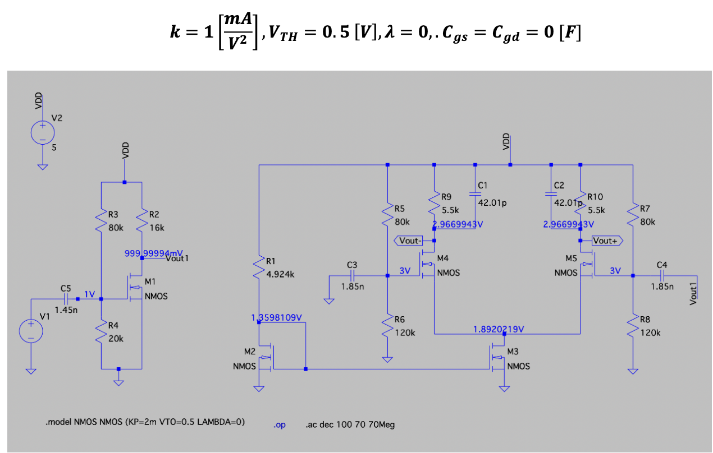
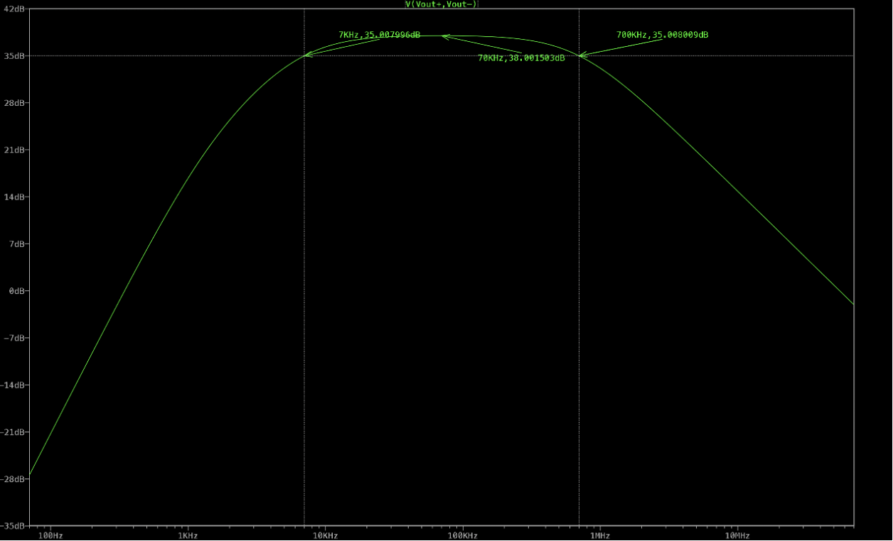
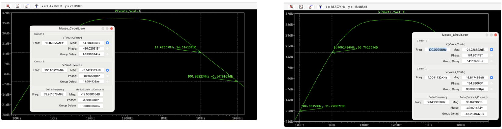
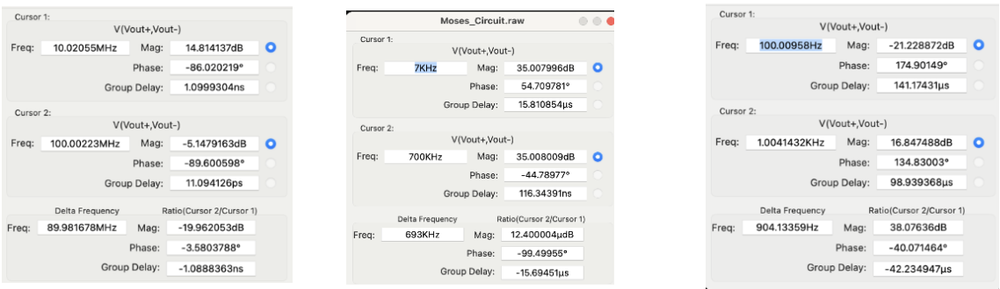
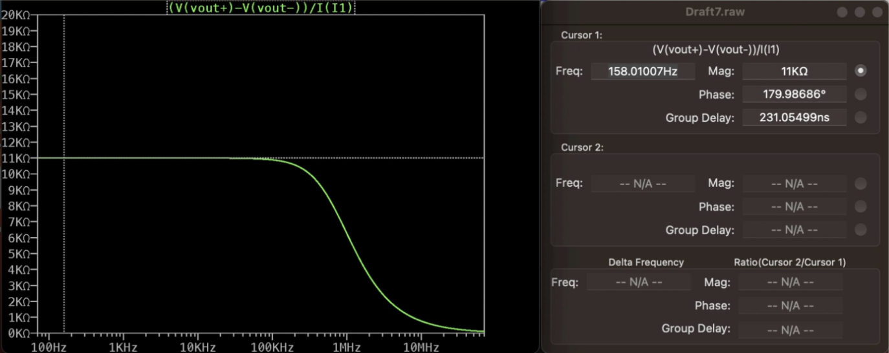

# Multi-Stage CMOS Analog Amplifier Design

## Overview
This repository contains the complete design, analysis, and LTspice simulation of a multi-stage CMOS analog amplifier. Built from scratch as a final project in an Analog Electronics course, this design meets a strict set of target specifications including precise gain, bandwidth boundaries, and specific frequency roll-off slopes.

## Circuit Architecture
The amplifier architecture was designed to provide a single-ended input to differential output conversion while maintaining stable biasing.

**Design Breakdown:**
* **Input Stage:** A Single-Ended Common Source (CS) amplifier (M1) that provides initial voltage gain.
* **Output Stage:** A fully symmetrical Differential pair (M4, M5).
* **Biasing:** A Current Mirror (M2, M3) is utilized to set a stable tail current of approximately 0.74mA.
* **Transistor Parameters:** Designed using $V_{TH} = 0.5\text{V}$, $\lambda = 0$, and $k = 1\text{mA/V}^2$.

## DC Analysis & Bias Point Validation
A rigorous DC analysis was performed to ensure all transistors operate in the saturation region. The table below compares the hand-calculated values with the LTspice simulation results:

| Parameter | Calculated Value | Simulated Value | Error (%) |
| :--- | :--- | :--- | :--- |
| **M1 ($I_D$)** | 0.25 mA | 0.25 mA | 0% |
| **M2, M3 ($I_D$)** | 0.739 mA | 0.739 mA | 0% |
| **M4, M5 ($I_D$)** | 0.3696 mA | 0.370 mA | 0.1% |
| **M4, M5 ($V_{DS}$)** | 1.075 V | 1.07 V | 0.4% |

## Performance & Simulation Results

### 1. Frequency Response (Bode Plot)
The primary requirement was to achieve a mid-band gain of 38 dB, bounded by a lower cut-off frequency ($f_L$) of 7 kHz and an upper cut-off frequency ($f_H$) of 700 kHz.

As seen in the AC simulation, the mid-band gain measures at **38.001 dB**, showing near-zero error from the target. The -3dB points are accurately placed at **7 kHz** and **700 kHz**.

### 2. Bandwidth & Roll-Off Slopes Verification
The frequency response shaping was verified using LTspice cursor measurements. To confirm the filter order, we measured the gain change over a frequency decade.

The measurement panels validate our key metrics:
* **Low-Frequency Slope ($M_1$):** Achieved **38.076 dB/dec** (Target: 40 dB/dec). This confirmed a second-order behavior.
* **High-Frequency Slope ($M_2$):** Achieved **-19.962 dB/dec** (Target: -20 dB/dec), confirming first-order low-pass behavior.
* **Cut-off Frequencies:** Precise -3dB drop at 7 kHz and 700 kHz as shown in the center measurement window.

### 3. Output Resistance
The project required a differential output resistance ($R_{out}$) of 11 kΩ.

The simulation confirms that within the mid-band, the resistance is stable at **11 kΩ**. The impedance drops at higher frequencies as the load capacitors provide a low-impedance path to the AC ground.

## Specification Summary & Compliance
The design successfully adheres to all physical limitations and performance targets:

| Parameter | Target Specification | Simulated Result | Status |
| :--- | :--- | :--- | :--- |
| **Mid-Band Gain ($A$)** | 38 dB | 38.001 dB | PASS |
| **Lower Cut-off ($f_L$)** | 7 kHz | 7 kHz | PASS |
| **Upper Cut-off ($f_H$)** | 700 kHz | 700 kHz | PASS |
| **Output Resistance** | 11 kΩ | 11 kΩ | PASS |
| **Total Resistance** | < 5 MΩ | 0.5319 MΩ | PASS |
| **Total Capacitance** | < 1 mF | 0.00378 mF | PASS |
| **Power Consumption** | < 0.1 W | 9.065 mW | PASS |

## Project Documentation
For a detailed mathematical analysis, including small-signal derivations and full design methodology, please refer to the complete report:
* [📄 Final Project Report (PDF)](Final_Project_Report.pdf)

## Getting Started
1. Clone this repository.
2. Open `cmos_amplifier_design.asc` in **LTspice**.
3. Run the `.op` (Operating Point) and `.ac` (AC Sweep) simulations to verify the results.
